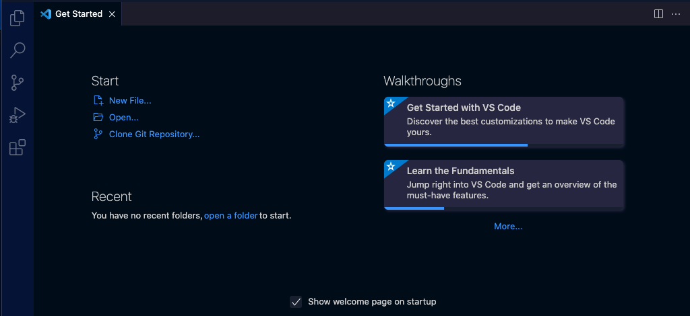
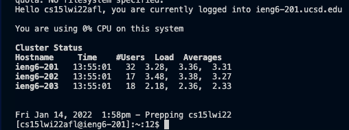
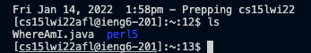
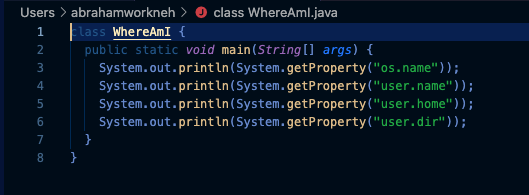
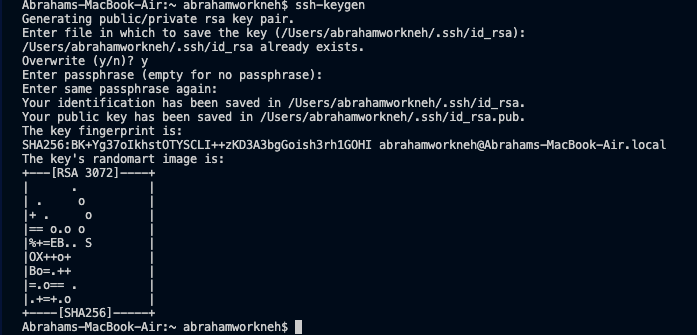
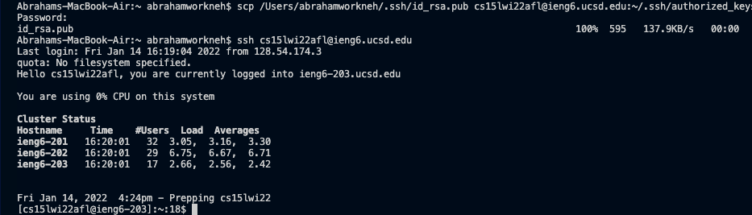
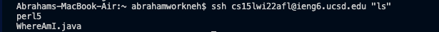

# **Lab Report 1**

This lab will be a tutorial on how to set up, connect to, and use the *ieng6* servers from your computer.

## Step 1: Installing VS Code
* We will be using VS code as our code editor in this class. 
* You can download VS code for all the major operating systems [here](https://code.visualstudio.com/); I used the mac version.
* Once downloaded and set up, you should arrive at this screen:


## Step 2: Remotely Connecting
* We will be logging into the servers via SSH (Secure Shell)
* If you are on a windows computer, you must download [Open SSH](https://docs.microsoft.com/en-us/windows-server/administration/openssh/openssh_install_firstuse), otherwise you can just use the terminal in VS code or your computer.
* Before connecting via SSH, you must [find your course specific account for CSE 15L](https://sdacs.ucsd.edu/~icc/index.php) and reset the password
* After finding your account and reseting the password, you can open up your terminal in VS code  and enter this command, 
`$ ssh cs15lwi22abc@ieng6.ucsd.edu`, only replacing `abc` with your own unique letters
* If it is your first time connecting, it will ask you if you want to continue connecting to whicbh you say "yes". Then you will enter your password for the account, and that should get you to a screen like this:


## Step 3: Trying some commands
* Next we will be trying various commands in the terminal such as `cd` or `ls` and learning what they do.
* For example, `ls` prints the contents of the current directory:

* We can learn more commands from [here](https://www.hostinger.com/tutorials/linux-commands) 

## Step 4: Moving files with `scp`
* The `scp` (Secure CoPy) command copies a file from the client (your computer) to the server (remote computer).
* For example, if we create a file called `WhereAmI.java` as so:
```
class WhereAmI {
  public static void main(String[] args) {
    System.out.println(System.getProperty("os.name"));
    System.out.println(System.getProperty("user.name"));
    System.out.println(System.getProperty("user.home"));
    System.out.println(System.getProperty("user.dir"));
  }
}
```

* We can use the command `$ scp WhereAmI.java cs15lwi22abc@ieng6.ucsd.edu:~/` in order to copy this file to our home directory in the server, which we can check by using `ls`.

## Step 5: Setting an SSH key
* By seting up an SSH key using `$ ssh-keygen`, a pair of files is created, one for the client and one for the server.
* After entering  `$ ssh-keygen` in the terminal, you should see something like this:

* You are prompted to create your own password or choose where to save the file, but it is ok to just press enter for these steps which leaves it as default with no password, which is what I did.
* Next you ssh into the server with password as usual in order to make a directory called `.ssh` using the command `$ mkdir .ssh`, afterwhich you logout.
* Now that the `.ssh` directory is made, you can scp the public file to said directory with this command `$ scp /Users/<your username>/.ssh/id_rsa.pub cs15lwi22abc@ieng6.ucsd.edu:~/.ssh/authorized_keys` which should prompt you to enter your password one last time.
* You should see something like this upon completion:

* You will now be able to ssh into the server without any password.

## Step 6: Optimizing Remote Running
* There are some ways you can make running commands faster.
* For example, by adding "command" to the end of your ssh, you will ssh into the server and immediately run said command upon conncection:

* Another optimization trick is using semicolons to run multiple commands (i.e `$ javac WhereAmI.java; java WhereAmI`)
* Rather than re-typing commands, you also simply press the up key to cycle through previously used commands
