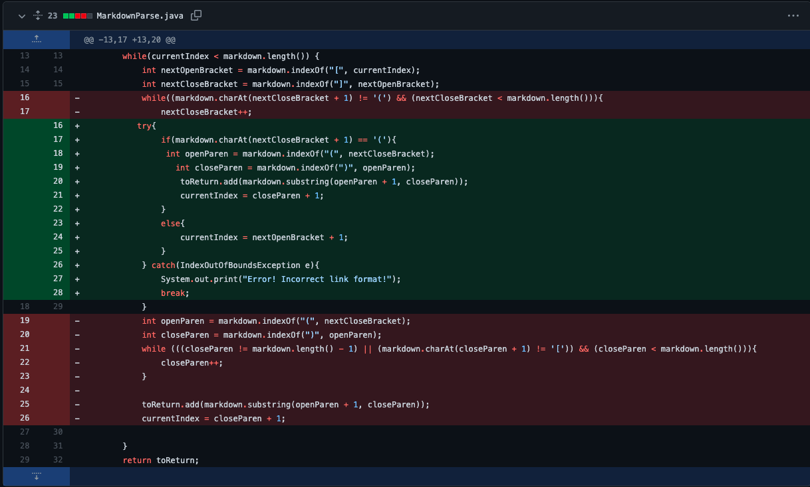
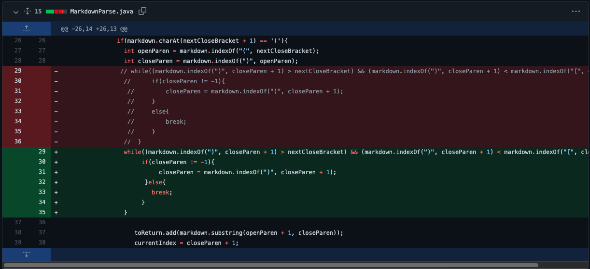
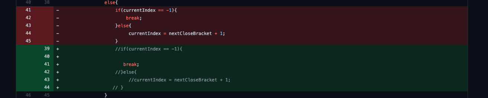

**Lab Report 2:**

* **Bug 1:** I made a [test-file](https://github.com/broham6/markdown-parse/blob/7d0bcc8c297db6f6afbab1a5617037147b82576e/breaking-test.md) with no parentheses.
* Symptom: The program searchs for the parentheses but doesn't find any, resulting in a IndexOutOfBoundsException being thrown.
* Console Output: 
        Exception in thread "main" java.lang.StringIndexOutOfBoundsException: begin 0, end -1, length 6
        at java.base/java.lang.String.checkBoundsBeginEnd(String.java:3751)
        at java.base/java.lang.String.substring(String.java:1907)
        at MarkdownParse.getLinks(MarkdownParse.java:20)
        at MarkdownParse.main(MarkdownParse.java:37)
 * Fix: Added a try and catch statement that would print out an error message telling the user that the markdown file is using the incorrect format - 
 
        
* **Bug 2:** I made a  with a pair of parantheses in the middle of the link.
* Symptom: The code printed the incorrect output
* Console Output:[parantheses-in-the-middle(, link.html]
* Fix: I made a while loop that would locate the correct closing parantheses: 
* Note: The deleted parantheses were to see console ouput before the fix was added.
        
* **Bug 3:** I made a  with a space in between the brackets and the parantheses that contained words in it.
* Symptom: There was an infinite loop.
* Console Output: None, I had to stop running the program.
* Fix: I altered the if-else statement in my try statement to break if the next character after the close bracket wasn't an open paranthesis: 
