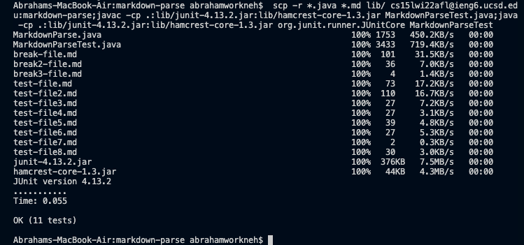

**Lab Report 3:**

*Topic:* Copy Whole Directories with `scp -r`

* The first thing I did was ssh into my ieng6 account and make sure that my markdown-parse directory wasn't already there: 
* After that, I ran the command `scp -r . cs15lwi22@ieng6.ucsd.edu:~/markdown-parse`, but that didn't work due to version differences: 

* I then ran the command `scp -r *.java *.md lib/ cs15lwi22@ieng6.ucsd.edu:markdown-parse` in order to just get the java, md, and lib files, and that ended up working fine. I followed up by running the JUnit tests and they passed: 
* Lastly, I tried running the `scp -r` and JUnit tests together in one line and it also worked: 