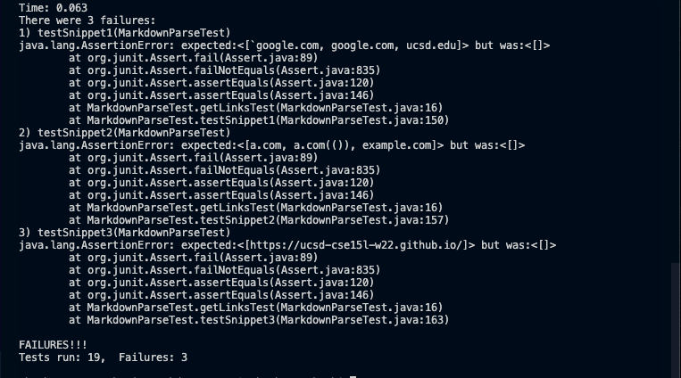

**Lab Report 4:**
*Snippet 1:* 
- Expected ouput: ['google.com, google.com, ucsd.edu]
- Tests did not pass for both impmentations.

*Snippet 2:*
- Expected output: [a.com, a.com(()), example.com]
- Tests did not pass for both implementations.

*Snippet 3:*
- Expected output: [https://ucsd-cse15l-w22.github.io/]
- Tests did not pass for both impmentations.

*Results:*
- Mine: 
- Reviewed Implementation: 

*Tests:*
- Mine: 
- Reviewed Implementation: 

*Questions:*
- I believe a fix could be made in the case of backticks that would be less than 10 lines. We would have to implement our normal bracket
and parantheses search method but once a backtick is found, we would iterate and ignore all other characters until the next backtick was found. 
Once found, we would go about our normal method. 
- For the nested case, I think it would take more than 10 lines. We would have to count both opening and closing brackets and see if there are a corresponding
number of opening and closing parentheses. For nested parantheses, we simply need to find the last closing parantheses and all the others would be part of the link.
- I'm not too sure how to handle newlines, but from what I've seen, it might be possible to handle them in under 10 lines. We would have to check that there aren't
any new lines within the parantheses. If there are, that url shound't be added to the list of links.
